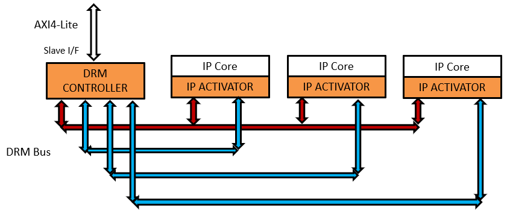

Implementation guidelines
=========================

Instantiation and connection
----------------------------

Only one DRM Controller can be instantiated in the Chip Design to serve multiple Protected IPs.

   * Specify the number of protected IP instances and get an appropriate DRM CONTROLLER; indeed, the DRM Bus I/F topology depends on the number of Protected IPs to be connected.
   * Instantiate the DRM CONTROLLER at the top level of the design
   * Assign a System Bus address to the DRM Controller with the natural generic parameter SYS_BUS_ADR_BEGIN
   * Assign the actual size of the System Bus Address ports with the natural generic parameter SYS_BUS_ADR_SIZE
   * Connect the DRM Controller to the System Bus
   * Connect the DRM Controller and the different protected IP instances with the DRM Bus
   
   
Example of a DRM Environment Topology

**AXI4-Lite connection**

Standard Ports Connections

**DRM Bus connection**

   * Given the number of protected IP (N) connected on the DRM Bus, a DRM Controller component with N sockets DRM_BUS_MASTER_O_CS_n, DRM_BUS_MASTER_I_DAT_n, DRM_BUS_MASTER_I_ACK_n, DRM_BUS_MASTER_I_INTR_n, DRM_BUS_MASTER_I_STA_n, with n = 0 to N-1
   * Each protected IP is connected on the DRM Bus :
   
      * Common connections : DRM_aCLK, DRM_aRSTn, DRM_BUS_MASTER_O_CYC, DRM_BUS_MASTER_O_WE, DRM_BUS_MASTER_O_ADR, DRM_BUS_MASTER_O_DAT
      * Dedicated connections to one socket : DRM_BUS_SLAVE_I_CS, DRM_BUS_SLAVE_O_DAT, DRM_BUS_SLAVE_O_ACK, DRM_BUS_SLAVE_O_INTR, DRM_BUS_SLAVE_O_STA

FPGA supported
--------------

Below the table that provides FPGA families supported by DRM Controller IP

.. list-table::
   :header-rows: 1

   * - FPGA Vendor
     - Families
   * - **Xilinx**
     - ultrascale+, ultrascale, virtex 7, virtex 6, spartan 6, spartan 3a dsp,spartan 3a, kintex 7, artix 7
   * - **Intel**
     - cyclone v, arria 10,  arria v gz, arria v, stratix v

FPGA tools supported
--------------------

Below the table that provides FPGA programming tools supported by DRM Controller IP

.. list-table::
   :header-rows: 1

   * - FPGA Vendor
     - Versions
   * - **Xilinx**
     - Vivado 2018.2, 2017.4, 2017.2, 2016.4, 2016.2
   * - **Intel**
     - Quartus Prime v18.1, v18.0, v17.1, v17.0, v16.1, v16.0

Implementation results
----------------------

Example for a DRM Controller supporting 10 IPs:

.. list-table::
   :header-rows: 1

   * - FPGA
     - LUT
     - FF
     - RAM
   * - **Kintex ultrascale+**
     - 11500
     - 6600
     - 5 of 36Kbits, 20 of 18Kbits
   * - **Kintex 7**
     - 12000
     - 6750
     - 3 of 36Kbits, 20 of 18Kbits

Timings
-------

Below the table that list the performance of DRM Controller by Xilinx FPGA family:

.. list-table::
   :header-rows: 1

   * - Xilinx Family
     - Frequency
     - Device documentation
   * - **ultrascale+**
     - 200MHz
     - `ds923 <https://www.xilinx.com/support/documentation/data_sheets/ds923-virtex_ultrascale-plus.pdf>`_
   * - **ultrascale**
     - 200MHz
     - `ds923 <https://www.xilinx.com/support/documentation/data_sheets/ds923-virtex_ultrascale-plus.pdf>`_
   * - **virtex 7**
     - 100MHz
     - `ds183 <https://www.xilinx.com/support/documentation/data_sheets/ds183_Virtex_7_Data_Sheet.pdf>`_
   * - **virtex 6**
     - Missing Data
     - `ds152 <https://www.xilinx.com/support/documentation/data_sheets/ds152.pdf>`_
   * - **spartan 6**
     - 2MHz
     - `ds162 <https://www.xilinx.com/support/documentation/data_sheets/ds162.pdf>`_
   * - **spartan 3a dsp**
     - 100MHz
     - `ds610 <https://www.xilinx.com/support/documentation/data_sheets/ds610.pdf>`_
   * - **spartan 3a**
     - 100MHz
     - `ds529 <https://www.xilinx.com/support/documentation/data_sheets/ds529.pdf>`_
   * - **kintex 7**
     - 100MHz
     - `ds182 <https://www.xilinx.com/support/documentation/data_sheets/ds182_Kintex_7_Data_Sheet.pdf>`_
   * - **artix 7**
     - 100MHz
     - `ds181 <https://www.xilinx.com/support/documentation/data_sheets/ds181_Artix_7_Data_Sheet.pdf>`_     
     

Below the table that list the performance of DRM Controller by Intel FPGA family:

.. list-table::
   :header-rows: 1

   * - Intel Family
     - Frequency
     - Device documentation
   * - **cyclone v**
     - 100MHz
     - `altchipid <https://www.intel.com/content/dam/altera-www/global/en_US/pdfs/literature/ug/altchipid.pdf>`_ 
   * - **arria 10**
     - 30MHz
     - `altchipid <https://www.intel.com/content/dam/altera-www/global/en_US/pdfs/literature/ug/altchipid.pdf>`_ 
   * - **arria v gz**
     - 100MHz
     - `altchipid <https://www.intel.com/content/dam/altera-www/global/en_US/pdfs/literature/ug/altchipid.pdf>`_ 
   * - **arria v**
     - 100MHz
     - `altchipid <https://www.intel.com/content/dam/altera-www/global/en_US/pdfs/literature/ug/altchipid.pdf>`_ 
   * - **stratix v**
     - 100MHz
     - `altchipid <https://www.intel.com/content/dam/altera-www/global/en_US/pdfs/literature/ug/altchipid.pdf>`_ 

Not yet supported - primitive available on FPGA but no integrated in DRM Controller :

   * **Intel** 
      * cyclone 10 gx   
      * stratix 10 
      